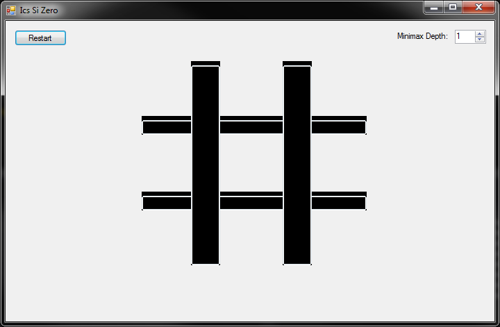
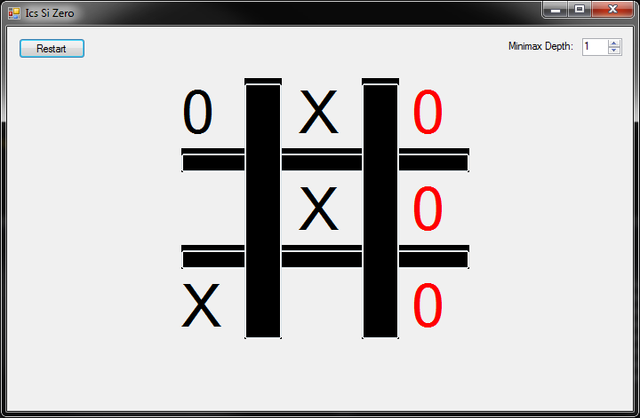
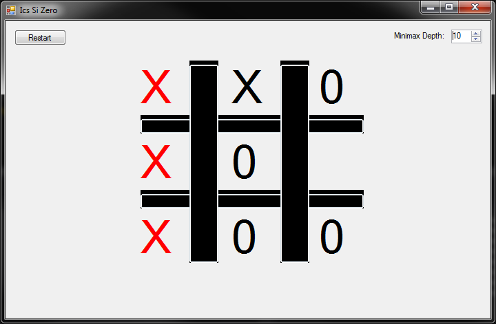
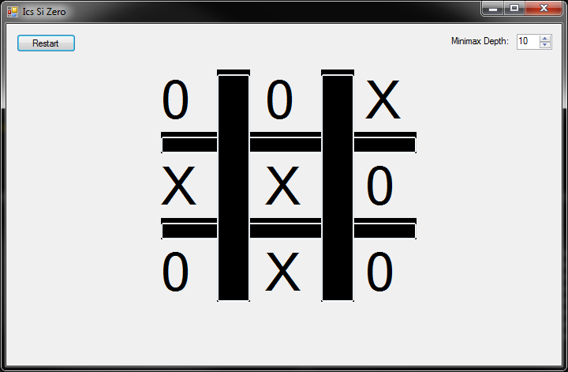

# TicTacToeMinimax
Minimax algorithm with alpha-beta pruning on tic-tac-toe gaym.

## License

 * This thing is distributed under Apache 2.0. See [LICENSE](LICENSE).

## Additional details

### Contact

You can find me [here][1] to ask questions.

[1]: https://github.com/Vasile2k